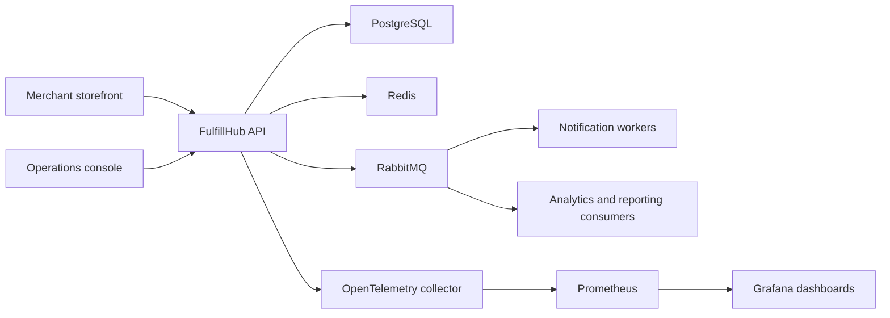

# Architecture Overview

FulfillHub starts as a modular monolith in Go with domain modules separated by interfaces, transaction boundaries, and event contracts. The current executable slice uses an in-memory store and outbox so API behavior, idempotency, and tenant authorization can be tested before PostgreSQL and RabbitMQ are introduced.

## System context

## Module boundaries

| Module | Responsibility | Writes data? | Emits events? |
| --- | --- | --- | --- |
| Orders | Accept orders, own saga state, expose status APIs | Yes | Yes |
| Inventory | Reserve and release stock | Yes | Yes |
| Payments | Track authorization and void operations | Yes | Yes |
| Shipments | Create carrier handoff and shipment timeline | Yes | Yes |
| Notifications | React to lifecycle events and send customer comms | No | Optional |
| Audit | Persist operator and system actions | Yes | No |
| Outbox relay | Deliver committed domain events to RabbitMQ | Reads outbox | No |

Current status:

- Orders and HTTP API are implemented.
- In-memory order storage and outbox event recording are implemented.
- PostgreSQL persistence, RabbitMQ relay, inventory, payment, shipment, and notification workers are planned.

## Request lifecycle

1. Merchant submits `POST /api/v1/orders` with API key and idempotency key.
2. Orders module validates tenant access and request shape.
3. Orders service stores the order, items, initial saga state, and outbox message.
4. The current slice keeps the outbox event in memory for testability.
5. The next persistence phase will commit order state and outbox rows in PostgreSQL.
6. The next messaging phase will relay `order.created` to RabbitMQ and project downstream outcomes.

## Observability model

- Every request creates a `request_id` and root trace span.
- Every emitted message carries `correlation_id` and `causation_id`.
- Queue consumers continue the trace and record handler latency and acknowledgement outcome.
- Dashboards highlight queue depth, saga completion rate, compensation rate, and readiness status.

## Deployment direction

Phase 1 should run locally via Docker Compose with:

- one Go API container
- PostgreSQL
- RabbitMQ
- Redis
- OpenTelemetry collector
- Prometheus
- Grafana

This is a deployment choice, not a commitment to long-term production topology.
