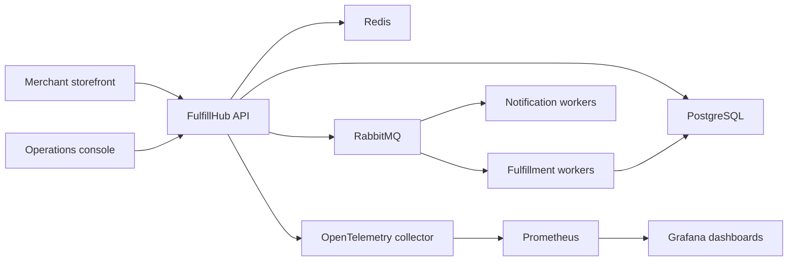

# Architecture Overview

FulfillHub starts as a modular monolith in Go with domain modules separated by interfaces, transaction boundaries, and event contracts. The current executable slice uses an in-memory store for fast tests, switches to PostgreSQL-backed order/outbox persistence when `DATABASE_URL` is configured, includes RabbitMQ relay and worker processes, and enables Redis-backed rate limiting when `REDIS_URL` is configured.

## System context

## Module boundaries

| Module | Responsibility | Writes data? | Emits events? |
| --- | --- | --- | --- |
| Orders | Accept orders, own saga state, expose status APIs | Yes | Yes |
| Inventory | Reserve and release stock | Yes | Yes |
| Payments | Track authorization and void operations | Yes | Yes |
| Shipments | Create carrier handoff and shipment timeline | Yes | Yes |
| Notifications | React to lifecycle events and send customer comms | No | Optional |
| Audit | Persist operator and system actions | Yes | No |
| Outbox relay | Deliver committed domain events to RabbitMQ | Reads outbox | No |

Current status:

- Orders and HTTP API are implemented.
- In-memory order storage and outbox event recording are implemented.
- PostgreSQL persistence is implemented.
- RabbitMQ relay code is implemented.
- RabbitMQ consumer primitives are implemented with trace continuation, inbox idempotency, and ack/nack behavior.
- The worker executable advances the inventory, payment, shipment, notification, compensation, and order-completion paths through durable projections and outbox writes.

## Request lifecycle

1. Merchant submits `POST /api/v1/orders` with API key and idempotency key.
2. Orders module validates tenant access and request shape.
3. Orders service stores the order, items, initial saga state, and outbox message.
4. The in-memory store keeps outbox events in memory for fast testability.
5. With `DATABASE_URL`, order state and outbox rows are committed in PostgreSQL.
6. `cmd/fulfillhub-outbox-relay` publishes pending outbox rows to RabbitMQ.
7. RabbitMQ consumers can continue trace context, record inbox deduplication, and acknowledge or dead-letter deliveries.
8. `cmd/fulfillhub-worker` persists inventory reservations, payment authorizations, and shipments, then writes the next saga event to the outbox.
9. Compose smoke profiling verifies the local runtime; longer Compose load,
   stress, and spike runs remain the main performance evidence gap.

## Observability model

- Every request creates a `request_id` and root trace span.
- Every emitted message carries `correlation_id` and `causation_id`.
- API request logs are structured JSON and include status, latency, request ID,
  correlation ID, actor type, and merchant ID when authenticated.
- HTTP spans extract W3C `traceparent` headers and can be exported locally with
  `OTEL_TRACES_EXPORTER=stdout`.
- PostgreSQL-backed stores create spans for order, outbox, inbox, and audit-log
  persistence operations when request context reaches the store.
- The outbox relay creates publish spans and injects W3C `traceparent` into
  RabbitMQ message headers.
- RabbitMQ consumers extract W3C `traceparent`, create consume spans, record inbox idempotency, and acknowledge successful deliveries.
- `/metrics` exposes RabbitMQ queue depth and consumer gauges when `RABBITMQ_URL` is configured.
- Dashboards highlight queue depth, saga completion rate, compensation rate, and readiness status.

## Deployment direction

The full local stack should run via Docker Compose with:

- one Go API container
- one outbox relay container
- fulfillment worker containers
- PostgreSQL
- RabbitMQ
- Redis
- OpenTelemetry collector
- Prometheus
- Grafana

This is a deployment choice, not a commitment to long-term production topology.
