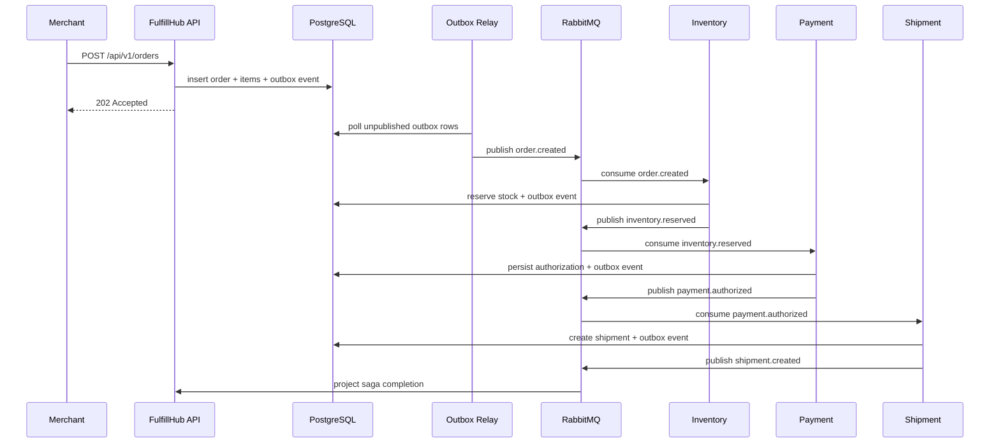

# Order Saga Sequence

Compensation rules:

- `inventory.rejected` ends the order as failed
- `payment.failed` releases stock and cancels the order
- `shipment.failed` triggers payment void and stock release when the shipment has not been handed off yet
