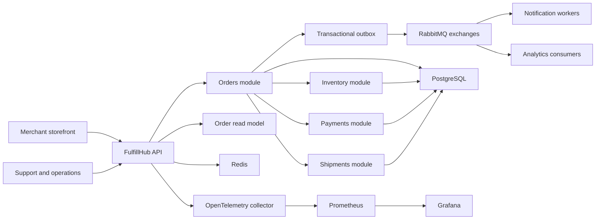

# System Context Diagram

```mermaid
flowchart LR
  storefront["Merchant storefront"] --> api["FulfillHub API"]
  support["Support and operations"] --> api
  api --> orders["Orders module"]
  api --> readmodel["Order read model"]
  orders --> inventory["Inventory module"]
  orders --> payments["Payments module"]
  orders --> shipments["Shipments module"]
  orders --> outbox["Transactional outbox"]
  outbox --> rabbit["RabbitMQ exchanges"]
  rabbit --> notifications["Notification workers"]
  rabbit --> analytics["Analytics consumers"]
  orders --> postgres["PostgreSQL"]
  inventory --> postgres
  payments --> postgres
  shipments --> postgres
  api --> redis["Redis"]
  api --> otel["OpenTelemetry collector"]
  otel --> prometheus["Prometheus"]
  prometheus --> grafana["Grafana"]
```

This diagram represents the intended Phase 1 shape. It is architecture guidance, not an implemented topology yet.
